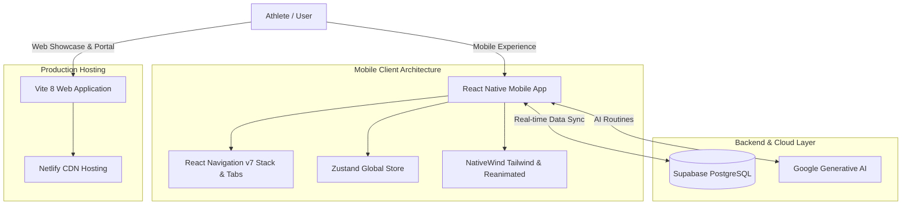

<div align="center">
  <a href="https://gymgo.milanwebportal.com">
    
  </a>
  <h1>GymGo - Ultimate Fitness Evolution</h1>
  <p><b>A premium, all-in-one fitness ecosystem designed for precision workout tracking and high-performance analytics.</b></p>

  <h2>
    <a href="https://gymgo.milanwebportal.com">EXPLORE GYMGO WEBSITE</a>
  </h2>

  <p>
    <a href="https://gymgo.milanwebportal.com">
      
    </a>
    <a href="https://github.com/milan-petkovski/GymGO/blob/main/LICENSE">
      
    </a>
    <a href="https://reactnative.dev/">
      
    </a>
    <a href="https://expo.dev/">
      
    </a>
    <a href="https://supabase.com/">
      
    </a>
    <a href="https://vite.dev/">
      
    </a>
  </p>

  <p>
    <b>Performance Tier:</b> Ultra-Optimized &bull; Cross-Platform &bull; Real-time Cloud Sync &bull; 120Hz Native Animations
  </p>
</div>

---

## Quick Navigation

- [About GymGo](#about-gymgo)
- [Platform Availability](#platform-availability)
- [Key Features](#key-features)
- [System Architecture &amp; Tech Stack](#system-architecture--tech-stack)
- [Repository Structure](#repository-structure)
- [Installation &amp; Setup](#installation--setup)
  - [Mobile Application (Application/)](#mobile-application-application)
  - [Official Website (Website/)](#official-website-website)
- [Author &amp; Support](#author--support)

---

## About GymGo

**GymGo** is an athlete-focused fitness tracking platform created to eliminate friction from workout logging, calorie management, and progressive overload tracking. Built with **React Native (New Architecture)**, **Expo**, and **Supabase**, it pairs a smooth mobile companion app with a lightning-fast web showcase powered by **Vite 8**.

---

## Platform Availability

| Platform                | Deployment State | Target Architecture                                                                                          |
| :---------------------- | :--------------: | :----------------------------------------------------------------------------------------------------------- |
| **Official Web Portal** |     **Live**     | Static Vite 8 bundle deployed on Netlify Edge ([gymgo.milanwebportal.com](https://gymgo.milanwebportal.com)) |
| **Android Application** |  In Development  | React Native 0.81 with EAS Build and Google Health Connect integration                                       |
| **iOS Application**     |  In Development  | Expo 54 universal build with Apple HealthKit support                                                         |

---

## Key Features

- **Smart Workout Logging**: Friction-free set, rep, and weight entry with automated rest timers and history recall.
- **Precision Nutrition Budgeting**: Calorie and macro target tracking with fast-entry meal logging and historical charts.
- **Performance Analytics**: Volume distribution graphs, 1RM estimates, and progressive overload forecasting via ChartKit.
- **Real-Time Cloud Synchronization**: Instant profile, workout, and metric replication backed by PostgreSQL and Supabase Auth.
- **Fluid 120Hz Interface**: Built with Reanimated 4 and NativeWind (Tailwind CSS) for stutter-free gesture responses.
- **AI-Assisted Recommendations**: Integrated Google Generative AI routines for intelligent workout adjustments.

---

## System Architecture & Tech Stack



### Core Technologies

- **Mobile Framework**: React Native 0.81, Expo 54, React 19
- **State Management**: Zustand 5
- **UI & Styling**: NativeWind (Tailwind CSS 3.3), Lucide React Native, Reanimated 4
- **Web Portal**: Vite 8, PostCSS, Tailwind CSS
- **Backend & Authentication**: Supabase (PostgreSQL, Realtime, Row Level Security)
- **AI Engine**: Google Generative AI SDK

---

## Repository Structure

```text
GymGO/
|-- Application/            # React Native / Expo mobile application source
|   |-- components/         # Reusable UI widgets and layout components
|   |-- navigation/         # Tab and Stack navigation configs
|   |-- screens/            # Workout, Nutrition, Analytics, Profile screens
|   |-- services/           # Supabase and AI client services
|   |-- store/              # Zustand global state slices
|   `-- App.js              # Application entry point
|-- Website/                # Vite-powered web showcase and landing page
|   |-- dist/               # Production build output
|   |-- index.html          # Landing page with interactive showcases
|   `-- vite.config.js      # Vite 8 build configuration
|-- netlify/                # Netlify deployment rules and redirects
`-- README.md               # Project documentation
```

---

## Installation & Setup

### Prerequisites

- Node.js 20.x or 22.x LTS
- npm or yarn
- Expo Go app (on physical phone) or Android Studio / Xcode simulator

### Mobile Application (`Application/`)

1. Navigate to the mobile application directory:
   ```bash
   cd Application
   ```
2. Install dependencies:
   ```bash
   npm install
   ```
3. Start the Expo development server:
   ```bash
   npx expo start
   ```
4. Scan the QR code with **Expo Go** (Android) or the Camera app (iOS) to launch the app.

### Official Website (`Website/`)

1. Navigate to the website directory:
   ```bash
   cd Website
   ```
2. Install dependencies:
   ```bash
   npm install
   ```
3. Start the local preview server:
   ```bash
   npm run dev
   ```
4. Build for production:
   ```bash
   npm run build
   ```

---

## Author & Support

Developed and maintained by **Milan Petkovski**.

- **Website**: [https://gymgo.milanwebportal.com](https://gymgo.milanwebportal.com)
- **Main Portal**: [https://milanwebportal.com](https://milanwebportal.com)
- **Contact Email**: `contact@milanwebportal.com`
- **Support**: [Support via PayPal](https://paypal.me/milanwebportal)

---

## License

This project is licensed under the [MIT License](LICENSE).
